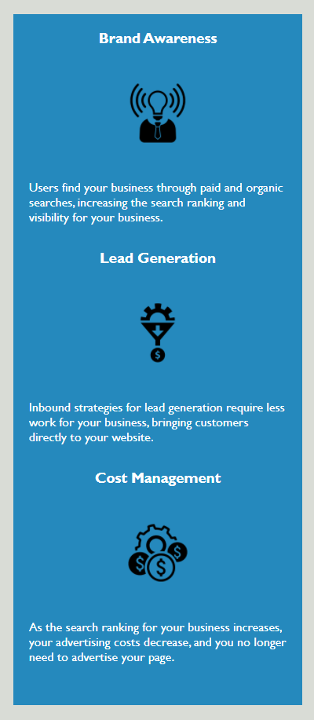

# Horiseon Solution Services site
A sample of a code refactoring project based on a mockup for a fictional company called Horiseon.

## Views

The following image should give an accurate representation on how the site currently looks:

The site contains interactive and functional links at the top which serve the purpose of navigating the site by redirecting the user to an element with a specific id:

Finally, some of the original benefits listed under the benefits section were changed to follow a better flow of information to the user:

## Changes

Some changes were made to the HTML file, including, but not limited to:

* Some classes were created to encapsule similar elements.
* Some class names were switched to IDs instead for better functionality.
* Previously disabled links are now functional
* Changed the position of some content elements for a better flow of information to the users.
* Reorganized the styles.css file and tagged the file accordingly with comments for a better understanding to the reader.
